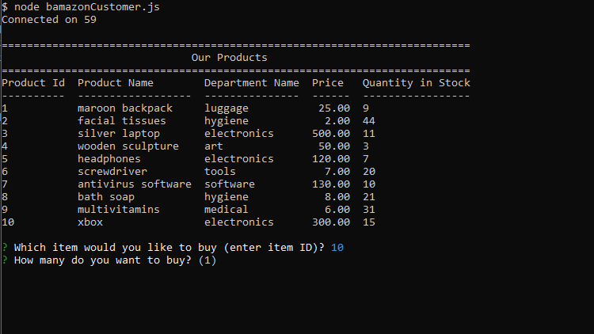
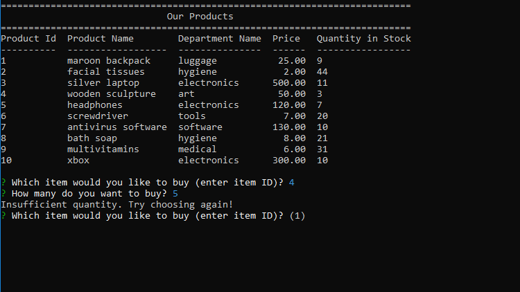

# Bamazon

Welcome to Bamazon. Here you can purchase products from a list of items we have in stock. 

## How it Works
***
### BamazonCustomer

Upon opening, a list will be displayed for the products we have currently.
There will be a prompt asking which item to purchase. Inputs have to be the item ID that you want (First column displayed).

***

There will be a second prompt asking for the quantity you want to buy.

***

If there is enough quantity in stock, your purchase will be successful and you will be shown the total price of your transaction

***

Otherwise, if there is not enough items in stock, a message will notify you to try again.

***

Both responses will prompt you to choose something else to buy.

---

### BamazonManager

Upon starting, you will be prompted with 4 choices to choose from.

***

#### View Products for Sale

Get a list of data of all the products currently. You will be prompted again afterwards for a task.

***

#### View Low Inventory

View all products that have a quantity less than 5.

***

#### Add to Inventory

Add quantity to the inventory count of a specific product on the list.
First prompt is asking for which product to add to (input has to be the item id).
Second prompt is the number to ADD to the stock quantity.

A message will display to show the updated quantity on selected product.
***

#### Add New Product

Add a new product to the database.
Answer the prompts asking for product name, department, price, and quantity.

***