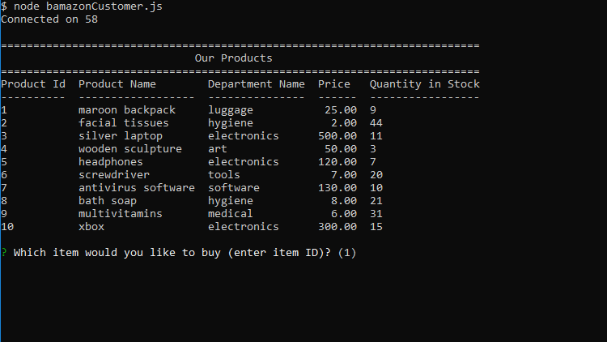

# Bamazon

Welcome to Bamazon. Here you can purchase products from a list of items we have in stock. 

## How it Works

Upon opening, a list will be displayed for the products we have currently.
There will be a prompt asking which item to purchase. Inputs have to be the item ID that you want (First column displayed).

There will be a second prompt asking for the quantity you want to buy.

If there is enough quantity in stock, your purchase will be successful and you will be shown the total price of your transaction

Otherwise, if there is not enough items in stock, a message will notify you to try again.

Both responses will prompt you to choose something else to buy.